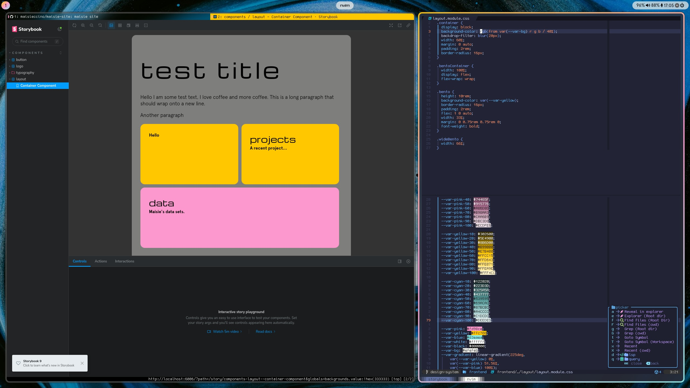

This is a list of the things I use.

## In my rucksack

It's a Fjallraven Kanken I've had for years. It's boxy, big and stores
everything I need.

- My journal (Leuchtturm1917 A5 dotted)
- Pen (~Kaweco Sport~) -> it's now a Lamy Safari!
- Earplugs for loud places (Loop Engage)
- A fidget toy (for when I need to ground myself)
- Essential oils for grounding

## On my computer

My desktop runs Linux with a few useful tools!

- Window manager: `hyprland`
- Editor: `neovim`
- Top bar: `waybar`
- Browser: `qutebrowser`
- Email: `aerc`

### My configuration files

These all live in the
[hello-computer](https://github.com/maisieccino/hello-computer) repository. Come
take a look!

## On my phone

Some useful apps I use. I'm using an iPhone as it seems to work for what I need.

### Obsidian

I use Obsidian to write and sync all my notes and ideas between all my devices.

### Visible

A service that uses a heart rate armband and an app to help pace my energy
during the day. I currently deal with an energy-limiting condition, so trying to
manage and understand my body is really important!

### WaterLlama

I use this to track my water intake. Hydration is really important for managing
my health conditions. It comes with a homescreen widget, reminders, and
different beverage tracking to help me get at least two litres per day.

### How We Feel

Mood/emotion tracker. The one built into Apple Health is okay, but it only
really tracks emotions on a single scale between "bad" and "good". This app is a
bit more faceted and lets you select from a long list of emotions, as well as
being able to link them with other factors. Such as what I'm up to during the
day, how much water/caffeine I've had, sleep, time in sunlight, that kind of
thing. Really interesting!

### Shortcuts

I use the built in Shortcuts app--a lot--to automate a bunch of things around my
life and home. My morning routine puts a bunch of morning tasks onto my
homescreen so I can remember to try and do as many as I can. Lights in my house
automatically dim when it's time to go to bed. Our coffee machine is programmed
to turn on as we wake up. I even have shortcuts to tell me if the local concert
venue has an event on, so I know to avoid it.

### Halide

This is what I use to take nice photographs on iPhone. It features fully manual
control, such as exposure, shutter speed and focus. But it also has a special
processing mode that removes all of the iPhone post-processing. It finally fixes
all of the annoying crispiness that iPhone's photo pipeline gives to things like
leaves and leading lines.
