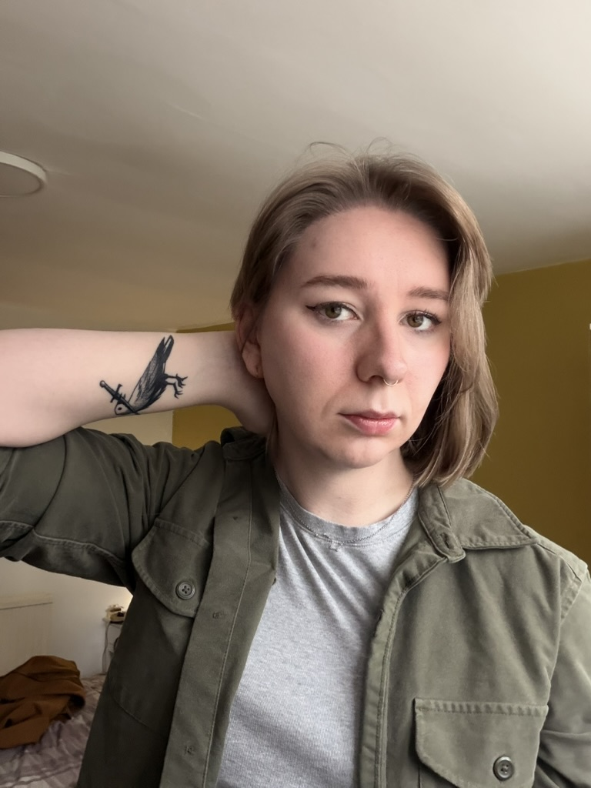

I got a crow tattoo.

This is my first ever tattoo! I reckon there will be more in the future and I will happily take recommendations.

Why a crow, you may ask? Crows have been an important part of my life for nearly two years now. I started feeding the local murder in the park next to my house with peanuts.

Crows, as it turns out, absolutely _adore_ unsalted peanuts when they're still in their shells. They seem to love using their beaks to smash open the shell and get the little treat inside.

Crows also seem to very quickly remember people who feed them snacks.

Any time I walk across the park, I will get at least a handful of my little buddies come fly over and start yapping. No matter what the weather or what I'm wearing, they always know I'm there. At some point, we've developed a bit of a game where I will toss the peanuts in the air and they will catch them. I hope they enjoy it!

While I've been struggling with various life goings ons, the local crows have been a constantly nice thing. They seem to appreciate that I'll bring them treats and company and genuinely seem happy to see me. Having a tiny impact on my environment like this makes me a little bit happier. :)

## Why does the crow have a dagger?

Because it looks cool, doesn't it?
